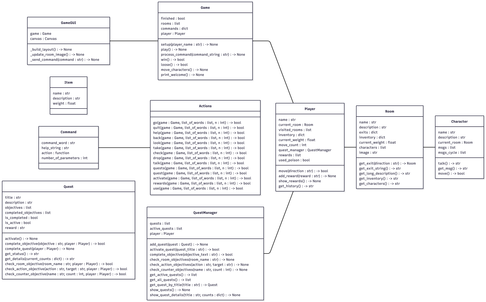

# Projet-TBA : Jeu d'Aventure Textuel

Jeu d'aventure textuel (Text-Based Adventure) développé en Python avec interface graphique Tkinter. Le joueur explore un monde rempli de salles, collecte des objets, interagit avec des personnages non-joueurs (PNJ), et complète des quêtes pour progresser dans le jeu.

## Caractéristiques

- 11 lieux explorables
- **Interface graphique** : Interface utilisateur basée sur Tkinter
- **Système de quêtes** : Quêtes avec objectifs et récompenses
- **Gestion d'inventaire** : Collecte et gestion des objets avec système de poids
- **Personnages interactifs** : PNJ qui se déplacent et peuvent être interrogés
- **Navigation spatiale** : Système de salles connectées avec sorties cardinales (N, E, S, O)
- **Système de récompenses** : Suivi des récompenses obtenues en complétant les quêtes
- **Système de quêtes complet** avec objectifs et récompenses
- Gestion des quêtes actives et complétées
- Suivi automatique de la progression des objectifs 

## Structure du projet

```
Projet-TBA-26/
├── game.py              # Moteur principal du jeu
├── player.py            # Gestion du joueur et de ses attributs
├── room.py              # Définition des salles du monde
├── character.py         # Gestion des PNJ
├── item.py              # Définition des objets collectable
├── quest.py             # Système de quêtes
├── command.py           # Définition des commandes
├── actions.py           # Implémentation des actions du joueur
├── config.py            # Configuration du jeu
├── assets/              # Ressources du jeu (images, etc.)
├── README.md            # Ce fichier
└── vidéo.mp4            # Une vidéo de présentation du jeu
```

## Modules principaux

### game.py
Contient la classe `Game` qui gère l'état global du jeu : les salles, les quêtes, les commandes, et l'interaction avec le joueur.

### player.py
Gère la classe `Player` : position du joueur, inventaire, quêtes actives et récompenses.

### room.py
Définit la classe `Room` représentant une salle du jeu avec ses sorties, objets et personnages.

### character.py
Contient la classe `Character` pour les personnages non-joueurs qui peuvent parler et se déplacer.

### item.py
Définit la classe `Item` pour les objets collectable du jeu.

### quest.py
Système de quêtes avec classe `Quest` pour les objectifs et récompenses.

### actions.py
Implémente les 14 actions possibles : go, quit, help, back, look, take, check, drop, talk, quests, quest, activate, rewards, use.

### command.py
Définit la classe `Command` pour les commandes exécutables du jeu.

### Dossier assets

Le dossier `assets/` contient les ressources graphiques :
- Icônes de navigation (flèches directionnelles)
- Icônes d'aide et de sortie
- Images des différents lieux du jeu
- Diagramme des classes sous forme de fichier png

## Installation

Prérequis :
- Python 3.x
- Tkinter (généralement inclus avec Python)

## Lancement du jeu

Pour démarrer le jeu, exécuter simplement :
```bash
python game.py
```

Le jeu s'ouvrira dans une fenêtre graphique avec une interface utilisateur.

On peut toujours exécuter le jeu dans un terminal:
```bash
python game.py --cli
```


## Commandes disponibles

- `go <direction>` : Se déplacer dans une direction (N, E, S, O)
- `look` : Observer la salle actuelle
- `take <objet>` : Ramasser un objet
- `drop <objet>` : Laisser tomber un objet
- `check <objet>` : Examiner un objet
- `talk <personnage>` : Parler à un PNJ
- `quests` : Lister les quêtes disponibles
- `quest <nom>` : Consulter les détails d'une quête
- `activate <quête>` : Activer une quête
- `rewards` : Afficher les récompenses gagnées
- `use <objet>` : Utiliser un objet
- `back` : Retourner à la salle précédente
- `help` : Afficher l'aide
- `quit` : Quitter le jeu

## Description

Le jeu se joue dans un univers médiéval avec un village central divisé en deux parties entouré de lieux dans le même thème tels qu'un château, une forêt, des ruines, une grotte, etc. Vous plongez directement dans une avanture dans laquelle le royaume à besoin de vous pour être sauvé d'une menace. Explorez, discuter, accomplissez des quêtes pour atteindre l'objectif final. Différents items et personnages sont disponibles pour intéragir avec le monde et vous guider tout au long de votre aventure. 

Plongez dans un univers de dark fantasy ravagé par les ténèbres. Vous incarnez un chevalier, dernier survivant d’un mal ayant englouti votre royaume. Guidés par un destin funeste, explorez des terres maudites, traversez des zones oubliées, échangez avec des PNJ et accomplissez des quêtes afin de percer le mystère de la malédiction… et peut-être restaurer l’espoir là où il a disparu.

## Conditions de Victoire/Défaite 

Victoire : Vous devez réaliser les quêtes puis utiliser le poison de vérité dans le château de Verdenfall
Défaite : Si vous utilisez le poison dans une zone autre que Verdenfall sans avoir accompli les quêtes requises, vous serez immédiatement éliminés.

# Guide développeur : diagramme des classes



# Perspective de développement

Le système de récompenses n’apporte actuellement aucun réel avantage au joueur, et les objets ne permettent pas de combattre.

Nous pourrions ajouter :
– un système de points de vie
– un système de combat
– des PNJ agressifs
– un système de sauvegarde accessible dans des pièces spécifiques
